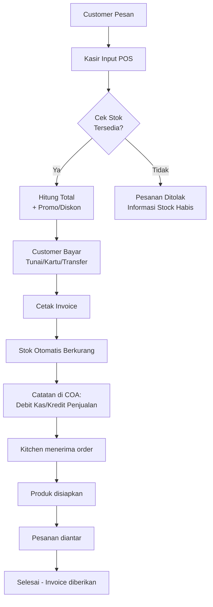
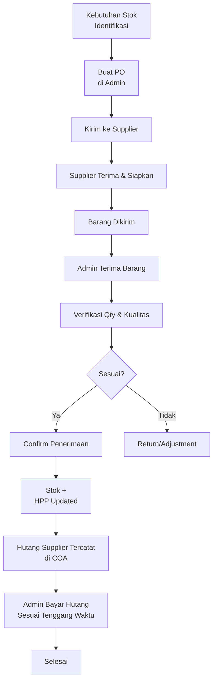
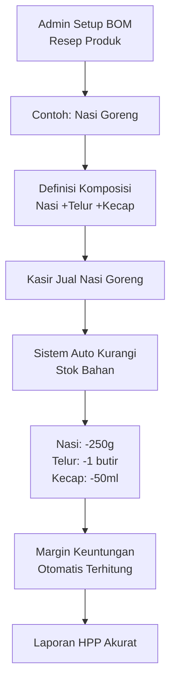
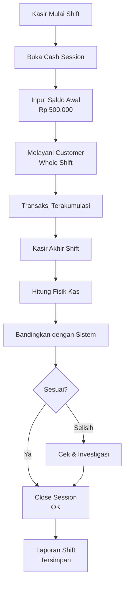
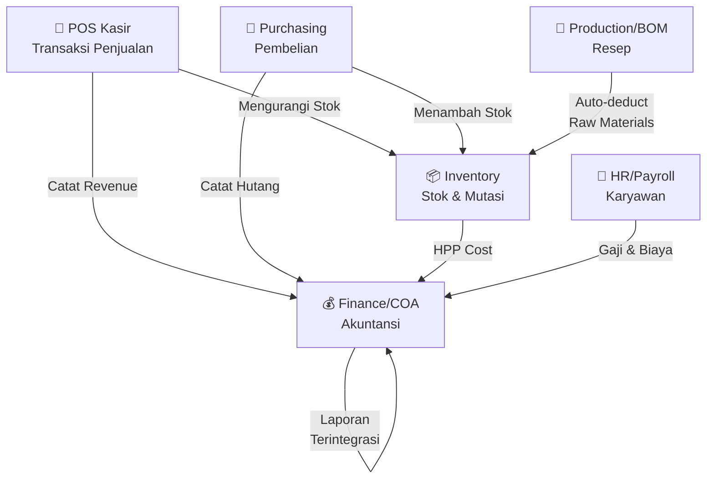

# 📊 DOKUMENTASI LENGKAP APLIKASI MOREST POS + BACK OFFICE

**Versi:** 1.0  
**Tanggal:** Mei 2026  
**Status:** Production Ready ✅

---

## 📑 DAFTAR ISI

1. [Ringkasan Aplikasi](#ringkasan-aplikasi)
2. [Struktur Pengguna & Akses](#struktur-pengguna--akses)
3. [Panduan Menu Back Office](#panduan-menu-back-office)
4. [Panduan Menu POS Kasir](#panduan-menu-pos-kasir)
5. [Alur Proses Bisnis](#alur-proses-bisnis)
6. [Integrasi Modul](#integrasi-modul)
7. [Tips & Troubleshooting](#tips--troubleshooting)

---

## 🎯 RINGKASAN APLIKASI

### Apa itu Morest?

Morest adalah sistem manajemen terintegrasi untuk restoran/kafe yang menggabungkan:
- **POS (Point of Sale)** untuk transaksi penjualan kasir
- **Back Office** untuk manajemen operasional lengkap
- **Inventory Management** untuk kontrol stok
- **Financial Accounting** untuk laporan keuangan
- **HR & Attendance** untuk manajemen karyawan
- **Production Management** untuk resep dan BOM

### Keunggulan Utama

✅ **Real-time Integration** - Semua modul saling terhubung secara instan  
✅ **Multi-Outlet Support** - Kelola banyak cabang dalam satu sistem  
✅ **Granular RBAC** - Kontrol akses detail per pengguna/modul  
✅ **Audit Trail** - Transparansi lengkap semua transaksi  
✅ **Financial Accurate** - Laporan keuangan standar akuntansi  
✅ **Production Ready** - Siap pakai tanpa perlu setup rumit

---

## 👥 STRUKTUR PENGGUNA & AKSES

### Jenis Role (Jabatan)

| Role | Akses | Fungsi Utama |
|------|-------|-------------|
| **Admin** | Penuh | Kelola semua modul, user, permission |
| **Manager** | Penuh (kecuali user management) | Monitoring dan approval |
| **Kasir** | POS & Dashboard | Transaksi penjualan |
| **Kitchen** | Kitchen Display | Input pesanan & status produksi |
| **Warehouse** | Inventory & Stock | Kelola stok gudang |
| **Finance** | COA, Reports, Bank | Accounting dan laporan keuangan |
| **HR** | Attendance, Payroll | Manajemen karyawan |
| **Pajak** | Reports, Compliance | Laporan pajak |

### Cara Mengakses

#### Login ke Aplikasi
```
URL: http://localhost:8000/login

Pilihan Login:
1. Login Username/Password (untuk semua user kecuali kasir)
2. Login PIN (untuk kasir via /pos/pin)
```

#### Flow Login Admin/Back Office
1. Klik tombol **Login** di halaman utama
2. Masukkan **Username** dan **Password**
3. Klik **Masuk**
4. Anda akan diarahkan ke **Admin Dashboard**

#### Flow Login Kasir (PIN)
1. Akses `/pos/pin`
2. Masukkan **4-digit PIN**
3. Pilih **Outlet**
4. Sistem otomatis membuka **POS Dashboard**

---

## 🏢 PANDUAN MENU BACK OFFICE (ADMIN PANEL)

### Lokasi: `http://localhost:8000/admin/`

```
BACK OFFICE NAVIGATION
├── 📊 Dashboard
├── 📦 Master Data
│   ├── Produk
│   ├── Outlet
│   ├── Supplier
│   ├── Metode Pembayaran
│   └── Tipe Penjualan
├── 💰 Keuangan & Akuntansi
│   ├── COA (Chart of Accounts)
│   ├── Cash Account
│   ├── Bank Transfer
│   ├── Transaksi Kas
│   └── Laporan Keuangan
├── 📦 Pembelian & Inventory
│   ├── Pembelian
│   ├── Stok
│   ├── Transfer Stok
│   ├── Produksi (BOM)
│   └── Adjustment Stok
├── 👥 Manajemen Pengguna
│   ├── User Management
│   ├── Permission Management
│   └── POS Device
├── 📱 Promosi & Marketing
│   ├── Promo & Voucher
│   └── Loyalitas
├── 📊 Laporan
│   ├── Penjualan
│   ├── Inventory
│   ├── Hutang (AP)
│   ├── Piutang (AR)
│   └── Karyawan
└── ⚙️ Pengaturan
    ├── Setting Sistem
    ├── Backdate Sales
    └── Void Token
```

---

### 1️⃣ DASHBOARD ADMIN

**Akses:** `http://localhost:8000/admin/dashboard`

#### Tampilan Utama
```
┌─────────────────────────────────────────────────┐
│           ADMIN DASHBOARD                       │
├─────────────────────────────────────────────────┤
│  📈 Revenue Today          💰 Balance Kas        │
│  Total Penjualan Hari Ini  Total Saldo Cash     │
│                                                  │
│  📊 Top Products           🏪 Outlets           │
│  Produk Terlaris          Status Semua Outlet  │
│                                                  │
│  👥 Active Users           🚨 Alert             │
│  User Aktif Hari Ini      Stock Habis/Minimum  │
└─────────────────────────────────────────────────┘
```

#### Fungsi Dashboard
- **Summary Cards**: Lihat ringkasan KPI harian
- **Charts**: Visualisasi penjualan & inventory
- **Quick Links**: Akses cepat ke modul utama
- **Notifications**: Alert stock, pending approval, dll

---

### 2️⃣ MASTER DATA

#### A. MANAJEMEN PRODUK

**Akses:** `/admin/products`

##### Tampilan Daftar Produk
```
Tabel Produk:
┌──────┬─────────────┬──────────┬────────┬────────┐
│ SKU  │ Nama Produk │ Kategori │ Harga  │ Status │
├──────┼─────────────┼──────────┼────────┼────────┤
│ SKU  │ Nama        │ Kategori │ Harga  │ Active │
│ SKU  │ Nama        │ Kategori │ Harga  │ Inactive
└──────┴─────────────┴──────────┴────────┴────────┘
```

##### Cara Menambah Produk Baru

**Step 1: Buka Form Tambah Produk**
```
1. Klik tombol "Tambah Produk" (warna hijau)
2. Anda akan masuk form input produk
```

**Step 2: Isi Data Produk**
```
Form Input:
┌─────────────────────────────────┐
│ SKU: [Auto Generated]           │ ← Sistem auto generate
│ Nama Produk: [Input]            │ ← Required
│ Kategori: [Dropdown]            │ ← Pilih dari dropdown
│ Deskripsi: [Text]               │ ← Optional
│ Harga Jual: [Rp]                │ ← Harga normal
│ Harga Beli: [Rp]                │ ← Untuk HPP
│ Unit: [Pilih: pcs/gram/liter]   │ ← Required
│ Stok Minimum: [Angka]           │ ← Alert jika di bawah ini
│ Gambar: [Upload]                │ ← Optional
│ Status: [Active/Inactive]       │ ← Default: Active
│ Tags: [Multi-select]            │ ← Optional untuk filter
└─────────────────────────────────┘
```

**Step 3: Simpan**
```
1. Klik tombol "Simpan Produk"
2. Sistem akan validasi data
3. Jika sukses → Redirect ke daftar produk
4. Jika error → Lihat pesan error dan perbaiki
```

##### Cara Edit Produk
```
1. Di daftar produk, cari produk yang ingin diedit
2. Klik tombol "Edit" (warna biru)
3. Modifikasi data yang perlu diubah
4. Klik "Simpan Perubahan"
```

##### Import Produk dari Excel
```
1. Di daftar produk, klik "Import dari Excel"
2. Download template Excel
3. Isi data produk sesuai template
4. Upload file Excel
5. Preview data sebelum import
6. Klik "Proses Import"

Template Excel harus memiliki kolom:
- SKU
- Nama Produk
- Kategori
- Harga Jual
- Harga Beli
- Unit
```

---

#### B. MANAJEMEN OUTLET

**Akses:** `/admin/outlets`

##### Cara Menambah Outlet Baru
```
1. Klik "Tambah Outlet"
2. Isi form:
   - Kode Outlet: [Input unik]
   - Nama Outlet: [Input]
   - Alamat: [Text area]
   - Kota/Propinsi: [Pilih]
   - No Telepon: [Input]
   - Email: [Input]
   - Jam Buka: [Time picker]
   - Jam Tutup: [Time picker]
   - Manager: [Pilih user]
   - Status: [Active/Inactive]
3. Klik "Simpan Outlet"
```

##### Fitur Outlet
- **Edit**: Ubah data outlet
- **Lihat Detail**: Informasi lengkap outlet
- **Kelola User Outlet**: Assign user ke outlet tertentu
- **Stock Outlet**: Lihat stok per outlet

---

#### C. MANAJEMEN SUPPLIER

**Akses:** `/admin/suppliers`

##### Cara Menambah Supplier
```
1. Klik "Tambah Supplier"
2. Isi form:
   - Kode Supplier: [Auto atau manual]
   - Nama Supplier: [Input]
   - Kontak Person: [Input]
   - Email: [Input]
   - Telepon: [Input]
   - Alamat: [Text area]
   - Kota: [Pilih]
   - NPWP: [Input]
   - Rekening Bank: [Input]
   - Status: [Active/Inactive]
3. Klik "Simpan"
```

##### Fitur Supplier
- **Edit Data**: Ubah informasi supplier
- **History Pembelian**: Lihat riwayat pembelian dari supplier
- **Hutang**: Monitor hutang ke supplier ini
- **Kontak**: Simpan multiple kontak person

---

#### D. METODE PEMBAYARAN

**Akses:** `/admin/payment-methods`

##### Jenis Metode Pembayaran yang Didukung
```
1. Tunai (Cash)
2. Debit Card (Visa, Mastercard, dll)
3. Transfer Bank
4. E-Wallet (GoPay, OVO, Dana, dll)
5. Cicilan
```

##### Cara Tambah Metode Pembayaran
```
1. Klik "Tambah Metode"
2. Isi form:
   - Nama: [Contoh: Tunai, GoPay, Mandiri, dll]
   - Tipe: [Pilih dari dropdown]
   - Akun Kas: [Pilih akun untuk pencatatan]
   - Aktif: [Checkbox]
3. Klik "Simpan"
```

---

#### E. TIPE PENJUALAN

**Akses:** `/admin/sales-types`

##### Contoh Tipe Penjualan
```
1. Dine In (Makan di tempat)
2. Takeaway (Beli untuk dibawa)
3. Delivery (Pengiriman)
4. Online (Pesanan online)
```

##### Fungsi
- Kategorisasi jenis penjualan untuk laporan lebih detail
- Tracking berbeda untuk setiap tipe

---

### 3️⃣ KEUANGAN & AKUNTANSI

#### A. CHART OF ACCOUNTS (COA)

**Akses:** `/admin/coa-accounts`

**Apa itu COA?**
COA adalah struktur akun-akun untuk pencatatan transaksi keuangan yang mengikuti prinsip akuntansi standar (Debit-Kredit).

##### Struktur Dasar COA
```
1. AKTIVA (ASSET)
   1. Kas
   2. Bank
   3. Piutang Usaha
   4. Persediaan
   5. Aset Tetap

2. KEWAJIBAN (LIABILITY)
   1. Hutang Usaha
   2. Hutang Bank
   3. Hutang Pajak

3. EKUITAS (EQUITY)
   1. Modal Awal
   2. Laba Ditahan

4. PENDAPATAN (REVENUE)
   1. Penjualan
   2. Service Revenue

5. BEBAN (EXPENSE)
   1. Harga Pokok Penjualan (HPP)
   2. Beban Operasional
   3. Beban Gaji
```

##### Cara Membuat Account Baru di COA
```
1. Klik "Tambah Akun"
2. Isi form:
   - Nomor Akun: [Contoh: 1-1-01 untuk Kas]
   - Nama Akun: [Input]
   - Tipe Akun: [Pilih: Asset/Liability/Equity/Revenue/Expense]
   - Saldo Normal: [Debit/Kredit]
   - Status: [Active/Inactive]
3. Klik "Simpan Akun"
```

##### Mapping Otomatis Transaksi ke COA

Sistem secara otomatis mencatat setiap transaksi ke akun yang sesuai:

```
Penjualan:
├─ Debit: Kas/Bank (Akun 1-1-01)
└─ Kredit: Penjualan (Akun 4-1-01)

Pembelian:
├─ Debit: Inventory (Akun 1-4-01)
└─ Kredit: Hutang Usaha (Akun 2-1-01)

Pembayaran Hutang:
├─ Debit: Hutang Usaha (Akun 2-1-01)
└─ Kredit: Kas (Akun 1-1-01)
```

---

#### B. CASH ACCOUNT (Akun Kas)

**Akses:** `/admin/cash-accounts`

**Fungsi:** Manajemen akun tunai/kas fisik di tempat usaha

##### Cara Tambah Cash Account
```
1. Klik "Tambah Akun Kas"
2. Isi form:
   - Nama Akun: [Contoh: Kas Outlet Pusat]
   - Lokasi: [Outlet mana]
   - Akun COA: [Pilih akun kas dari COA]
   - Saldo Awal: [Rp]
   - Tanggal Awal: [Tanggal]
   - Penanggung Jawab: [User/PIC]
3. Klik "Simpan"
```

##### Transaksi Kas
```
Akses: /admin/cash-transactions

Tipe Transaksi:
1. Kas Masuk (Penerimaan):
   - Penjualan
   - Piutang kembali
   - Lainnya

2. Kas Keluar (Pengeluaran):
   - Pembelian
   - Biaya operasional
   - Gaji karyawan
   - Lainnya

Flow Input Transaksi Kas:
1. Klik "Tambah Transaksi"
2. Pilih Tipe: [Masuk/Keluar]
3. Isi form:
   - Tanggal: [Pilih]
   - Akun: [Pilih cash account]
   - Keterangan: [Input detail]
   - Jumlah: [Rp]
   - Referensi: [Nomor dokumen]
4. Klik "Simpan"
```

##### Laporan Mutasi Kas
```
Akses: /admin/cash-accounts/{id}/mutation-report

Menampilkan:
- Saldo Awal
- Transaksi Masuk
- Transaksi Keluar
- Saldo Akhir
- Filter: Tanggal, Tipe Transaksi
```

---

#### C. BANK TRANSFER

**Akses:** `/admin/bank-transfers`

**Fungsi:** Catat transfer antar rekening bank perusahaan

##### Cara Input Transfer Bank
```
1. Klik "Buat Transfer"
2. Isi form:
   - Tanggal Transfer: [Pilih]
   - Dari Rekening: [Pilih rekening asal]
   - Ke Rekening: [Pilih rekening tujuan]
   - Jumlah: [Rp]
   - Referensi: [Nomor transfer]
   - Keterangan: [Tujuan transfer]
3. Klik "Simpan"
```

---

### 4️⃣ PEMBELIAN & INVENTORY

#### A. MANAJEMEN PEMBELIAN (PURCHASE)

**Akses:** `/admin/purchases`

##### Alur Pembelian Lengkap
```
1. BUAT PO (Purchase Order)
2. TERIMA BARANG (Receiving)
3. CATAT HUTANG (Vendor Bill)
4. BAYAR HUTANG (Payment)
```

##### Step 1: Buat Purchase Order (PO)

```
Akses: /admin/purchases/create

Form PO:
┌────────────────────────────────────┐
│ NOMOR PO: [Auto]                   │
│ TANGGAL: [Pilih]                   │
│ SUPPLIER: [Dropdown]               │
│ DEADLINE: [Pilih]                  │
│ CATATAN: [Text]                    │
├────────────────────────────────────┤
│ ITEM PEMBELIAN:                    │
│ ┌──────────┬────────┬──────┐       │
│ │ Produk   │ Qty    │ Harga│       │
│ ├──────────┼────────┼──────┤       │
│ │ [Pilih]  │ [Input]│[Input]       │
│ │ [Pilih]  │ [Input]│[Input]       │
│ └──────────┴────────┴──────┘       │
│ + Tambah Item                      │
├────────────────────────────────────┤
│ SUBTOTAL: Rp ...                   │
│ PPN: Rp ...                        │
│ TOTAL: Rp ...                      │
├────────────────────────────────────┤
│ [Simpan & Kirim]  [Simpan Draft]   │
└────────────────────────────────────┘
```

##### Step 2: Terima Barang (Receiving)

```
Akses: /admin/purchases/{id}/show
Klik Tombol: "Terima Barang"

Form Receiving:
1. Verifikasi item yang diterima:
   - Jumlah barang sesuai PO?
   - Ada kerusakan?
   - Tanda terima dari supplier?

2. Isi Quantity Diterima:
   ┌──────────────────────────────┐
   │ Produk          │ PO │ Terima│
   ├──────────────────┼────┼──────┤
   │ Nasi Goreng      │100 │ 100  │
   │ Mie Goreng       │ 50 │ 50   │
   │ Ayam Goreng      │ 30 │ 30   │
   └──────────────────┴────┴──────┘

3. Klik "Konfirmasi Penerimaan"
   → Stok otomatis bertambah
   → Hutang terbentuk
```

##### Step 3: Bayar Hutang

```
Akses: /admin/purchases/{id}/payment

Form Pembayaran:
1. Metode Pembayaran: [Pilih]
2. Jumlah Bayar: [Rp]
3. Tanggal Pembayaran: [Pilih]
4. Keterangan: [Input]
5. Klik "Proses Pembayaran"

Status PO:
- Draft → Sent → Received → Paid
```

---

#### B. MANAJEMEN STOK

**Akses:** `/admin/stocks`

##### Dashboard Stok
```
Menampilkan:
- Stock Overview per Outlet
- Low Stock Alert
- Stok Habis
- Grafik Stock Movement
```

##### Lihat Stock Card (Riwayat Mutasi)
```
Akses: /admin/stocks/card

Filter:
- Produk: [Dropdown]
- Outlet: [Dropdown]
- Tanggal Awal - Akhir: [Date Range]

Tabel Mutasi:
┌─────┬──────────┬───────┬────────┬──────────┐
│Tgl  │ Tipe     │ Qty   │ Saldo  │ Ket      │
├─────┼──────────┼───────┼────────┼──────────┤
│1/1  │ In (PO)  │ +100  │ 200    │ Pembelian│
│1/2  │ Out (Pj) │ -30   │ 170    │ Penjualan│
│1/3  │ Adjust   │ -5    │ 165    │ Opname   │
└─────┴──────────┴───────┴────────┴──────────┘
```

##### Stock Adjustment / Opname
```
Akses: /admin/stocks/adjustment

Fungsi: Sesuaikan stok sistem dengan fisik

Flow:
1. Klik "Buat Adjustment"
2. Pilih Outlet: [Dropdown]
3. Isi Item Adjustment:
   ┌──────────────┬──────────┬────────┐
   │ Produk       │ Qty Stok │ Qty    │
   │              │ Sistem   │ Fisik  │
   ├──────────────┼──────────┼────────┤
   │ Nasi Goreng  │ 50       │ 48     │
   │ Mie Goreng   │ 100      │ 102    │
   └──────────────┴──────────┴────────┘
4. Klik "Proses Adjustment"
   → Sistem otomatis hitung selisih
   → Mutasi tercatat lengkap dengan keterangan
```

---

#### C. TRANSFER STOK ANTAR OUTLET

**Akses:** `/admin/stock-transfers`

##### Alur Transfer Stok
```
1. BUAT TRANSFER
2. KIRIM (Sent)
3. TERIMA (Received)
4. SELESAI
```

##### Step 1: Buat Transfer
```
Form:
┌────────────────────────────────┐
│ NOMOR: [Auto]                  │
│ TANGGAL: [Pilih]               │
│ DARI OUTLET: [Dropdown]        │
│ KE OUTLET: [Dropdown]          │
├────────────────────────────────┤
│ ITEM TRANSFER:                 │
│ ┌──────────┬────────┐          │
│ │ Produk   │ Qty    │          │
│ ├──────────┼────────┤          │
│ │ [Pilih]  │ [Input]│          │
│ └──────────┴────────┘          │
│ + Tambah Item                  │
├────────────────────────────────┤
│ CATATAN: [Text]                │
├────────────────────────────────┤
│ [Simpan & Kirim]  [Simpan]     │
└────────────────────────────────┘
```

##### Step 2: Kirim Barang
```
1. Di daftar transfer, klik transfer yang akan dikirim
2. Klik tombol "Kirim"
3. Verifikasi item
4. Klik "Konfirmasi Pengiriman"
→ Stok outlet asal berkurang
→ Status menjadi "Sent"
```

##### Step 3: Terima Barang
```
Akses: /admin/stock-transfers/{id}/receive-form

1. Outlet penerima login
2. Lihat daftar transfer yang pending
3. Klik "Terima Barang"
4. Verifikasi qty yang diterima
5. Klik "Konfirmasi Penerimaan"
→ Stok outlet tujuan bertambah
→ Status menjadi "Completed"
```

---

#### D. PRODUKSI & BOM (Bill of Materials)

**Akses:** `/admin/boms` dan `/admin/productions`

**Apa itu BOM?**
BOM adalah resep/formula yang mendefinisikan bahan-bahan apa dan berapa qty yang diperlukan untuk menghasilkan satu produk jadi.

##### Contoh BOM

```
Nasi Goreng (1 Porsi) =
├── Nasi: 250g (-250g stok)
├── Telur: 1 buah (-1 stok)
├── Kecap Manis: 2 sendok (-0.05L stok)
└── Minyak: 1 sendok (-0.02L stok)
```

##### Cara Buat BOM Baru
```
1. Akses /admin/boms/create
2. Pilih Produk Jadi: [Dropdown - Nasi Goreng]
3. Isi detail:
   - Nama Resep: [Input]
   - Qty Output: [Berapa porsi/unit]
   - Bahan Utama: [Checkbox multiple]

4. Isi Komposisi Bahan:
   ┌──────────────┬────┬──────┐
   │ Bahan (Raw)  │ Qty│ Unit │
   ├──────────────┼────┼──────┤
   │ [Pilih]      │[In]│[Unit]│
   │ [Pilih]      │[In]│[Unit]│
   └──────────────┴────┴──────┘

5. Klik "Simpan BOM"
```

##### Cara Record Produksi
```
Akses: /admin/productions/create

Flow:
1. Pilih BOM: [Dropdown]
2. Pilih Outlet: [Dropdown]
3. Input Qty Produksi: [Angka]
4. Tanggal Produksi: [Pilih]
5. Catatan: [Optional]

Contoh:
- BOM: Nasi Goreng
- Qty: 50 (berarti 50 porsi)
- Otomatis akan mengurangi bahan:
  - Nasi: -12.5kg
  - Telur: -50 butir
  - Kecap: -100 sendok
  - Minyak: -50 sendok

6. Klik "Proses Produksi"
→ Stok bahan raw otomatis berkurang
→ Stok produk jadi tidak bertambah (masuk manual saat penjualan)
```

---

### 5️⃣ MANAJEMEN PENGGUNA & KEAMANAN

#### A. MANAJEMEN USER

**Akses:** `/admin/users` (Admin only)

##### Cara Tambah User Baru
```
1. Klik "Tambah User"
2. Isi form:
   - Username: [Input unik]
   - Email: [Input email]
   - Nama Lengkap: [Input]
   - Password: [Auto generate atau input]
   - Role: [Pilih: Admin, Manager, Kasir, Kitchen, dll]
   - Outlet: [Pilih outlet terkait]
   - Status: [Active/Inactive]
   - PIN (opsional): [4 digit untuk POS]

3. Klik "Simpan User"
→ User akan menerima email dengan credentials
→ User bisa login dan ubah password sendiri
```

##### Assign Role & Permission ke User
```
1. Pilih user dari daftar
2. Klik "Edit Permission"
3. Centang/unchecklist permissions:
   ✓ dashboard.view
   ✓ products.view
   ✓ products.create
   ✓ products.update
   ☐ products.delete
   ✓ sales.view
   ☐ sales.backdate.create
   dst...

4. Klik "Simpan Permission"
```

##### Module-level Permission

```
Contoh Permission untuk Kasir:
✓ pos.sales.create      → Bisa buat transaksi
✓ pos.sales.view        → Bisa lihat riwayat
☐ pos.sales.delete      → Tidak bisa batal transaksi
☐ reports.view          → Tidak bisa akses laporan
☐ products.delete       → Tidak bisa hapus produk

Contoh Permission untuk Manager:
✓ dashboard.view        → Lihat dashboard
✓ reports.view          → Lihat laporan
✓ sales.backdate.view   → Lihat backdate sales
☐ user.manage           → Tidak bisa kelola user
```

---

#### B. PERMISSION MANAGEMENT

**Akses:** `/admin/permissions` (Admin only)

**Struktur Permission:**

```
Modul: PRODUCTS
├─ products.view      (Lihat produk)
├─ products.create    (Buat produk baru)
├─ products.update    (Edit produk)
├─ products.delete    (Hapus produk)
└─ products.import    (Import dari Excel)

Modul: SALES
├─ sales.create       (Buat penjualan)
├─ sales.view         (Lihat penjualan)
├─ sales.cancel       (Batal penjualan)
├─ sales.backdate.create (Input backdate)
└─ reports.export     (Export data)

[dst... untuk modul lain]
```

---

#### C. POS DEVICE MANAGEMENT

**Akses:** `/admin/pos-devices`

**Fungsi:** Kontrol mesin/device POS yang boleh mengakses sistem

##### Cara Pair Device Baru
```
1. Di settings device baru, catat DEVICE ID
2. Kembali ke admin, buka POS Device Management
3. Klik "Pair Device Baru"
4. Isi form:
   - Device ID: [Paste dari device]
   - Outlet: [Pilih outlet]
   - Nama Device: [Contoh: POS Meja 1]
   - Description: [Optional]

5. Klik "Pair"
→ Device akan terdaftar dan bisa akses POS
```

##### Enforce Device Binding
```
Setting ini untuk memastikan kasir hanya bisa akses
dari device yang sudah didaftarkan.

1. Klik toggle "Enforce Device Binding"
2. Jika diaktifkan:
   - Kasir HANYA bisa login dari device terdaftar
   - Device lain akan DITOLAK

3. Jika tidak diaktifkan:
   - Kasir bisa login dari device manapun
```

##### Revoke Device
```
1. Pilih device dari daftar
2. Klik "Revoke"
3. Konfirmasi
→ Device akan diblokir dari akses POS
```

---

### 6️⃣ PROMOSI & MARKETING

#### A. PROMO & VOUCHER

**Akses:** `/admin/promo-vouchers`

##### Cara Buat Promosi

```
1. Klik "Buat Promosi Baru"
2. Isi form:
   - Nama Promo: [Contoh: Nasi Goreng Diskon 20%]
   - Tipe Diskon: [Fixed/Percentage]
   - Jumlah Diskon: [Input]
   - Produk Berlaku: [Multi-select]
   - Berlaku Untuk: [Menu/Category/Specific Item]
   - Tanggal Mulai: [Pilih]
   - Tanggal Akhir: [Pilih]
   - Jam Berlaku: [Start time - End time] (Optional)
   - Qty Min Purchase: [Min transaksi?]
   - Max Usage: [Berapa kali? Unlimited?]
   - Status: [Active/Inactive]

3. Klik "Simpan Promosi"
```

##### Cara Buat Voucher

```
1. Klik "Buat Voucher Baru"
2. Isi form:
   - Nama Voucher: [Contoh: SUMMER2024]
   - Tipe: [Fixed amount / Percentage]
   - Nilai: [Rp / %]
   - Max Usage: [Per voucher ada limit berapa?]
   - Tanggal Berlaku: [Start - End]
   - Produk Berlaku: [Pilih atau semua]
   - Min Transaksi: [Optional]
   - Qty Min Item: [Optional]

3. Klik "Generate"
→ Generate kode voucher otomatis
→ Bisa di-share ke customer
```

---

### 7️⃣ LAPORAN & ANALYTICS

**Akses:** `/admin/reports`

#### A. LAPORAN PENJUALAN

**URL:** `/admin/reports/sales`

```
Filter:
- Tanggal Awal - Akhir: [Date Range]
- Outlet: [Dropdown / All]
- Kasir: [Dropdown / All]
- Metode Pembayaran: [Dropdown / All]

Tampilan:
┌─────────────────────────────────────┐
│ SUMMARY:                            │
│ Total Penjualan: Rp ...            │
│ Total Transaksi: ... pcs           │
│ Rata-rata Transaksi: Rp ...        │
├─────────────────────────────────────┤
│ DETAIL TRANSAKSI:                   │
│ ┌─────┬───────┬─────────┬────────┐ │
│ │ No  │ Waktu │ Total   │ Kasir  │ │
│ ├─────┼───────┼─────────┼────────┤ │
│ │ 1   │ 10:30 │ Rp ...  │ Budi   │ │
│ │ 2   │ 11:45 │ Rp ...  │ Siti   │ │
│ └─────┴───────┴─────────┴────────┘ │
├─────────────────────────────────────┤
│ BREAKDOWN METODE PEMBAYARAN:        │
│ Tunai: Rp ... (80%)                │
│ Transfer: Rp ... (15%)             │
│ E-Wallet: Rp ... (5%)              │
├─────────────────────────────────────┤
│ [Export PDF]  [Export Excel]       │
└─────────────────────────────────────┘
```

#### B. LAPORAN PRODUK TERLARIS

**URL:** `/admin/reports/sales-products`

```
Menampilkan:
- Ranking produk berdasarkan qty/value
- Margin keuntungan
- Trend penjualan

Tabel:
┌────┬──────────────┬───┬────────┬───────┐
│Rank│ Produk       │Qty│ Total  │ %     │
├────┼──────────────┼───┼────────┼───────┤
│ 1  │ Nasi Goreng  │150│Rp 750K │ 35%   │
│ 2  │ Mie Goreng   │120│Rp 540K │ 25%   │
│ 3  │ Ayam Goreng  │100│Rp 800K │ 40%   │
└────┴──────────────┴───┴────────┴───────┘
```

#### C. LAPORAN KEUANGAN (COA Report)

**URL:** `/admin/reports/financials`

Menampilkan:
- **Trial Balance**: Validasi Debit = Kredit
- **Balance Sheet**: Posisi aset, liabilitas, ekuitas
- **Income Statement**: Pendapatan vs Beban
- **Cash Flow**: Aliran kas

---

### 8️⃣ PENGATURAN SISTEM

#### A. BACKDATE SALES

**Akses:** `/admin/backdate-sales`

**Fungsi:** Input penjualan manual dengan tanggal lampau (untuk koreksi data)

```
Cara Input Backdate Sales:
1. Klik "Input Backdate Sales"
2. Isi form:
   - Tanggal Penjualan: [Pilih tanggal lampau]
   - Outlet: [Pilih]
   - Kasir: [Pilih]
   - Produk & Qty: [Isi detail item]
   - Metode Pembayaran: [Pilih]
   - Total: [Rp]
   - Catatan: [Contoh: Koreksi penjualan tgl X]

3. Klik "Simpan"

Atau Import dari Excel:
1. Download template
2. Isi data sesuai template
3. Upload file
4. Preview & validasi
5. Klik "Proses Import"
```

---

## 🏪 PANDUAN MENU POS KASIR

### Lokasi: `http://localhost:8000/pos/`

```
POS NAVIGATION (untuk Kasir)
├── 📊 Dashboard
├── 🛒 Transaksi Penjualan
├── 💵 Shift Kasir (Buka/Tutup)
├── 👥 Absensi
├── 💰 Petty Cash
├── 🍳 Kitchen Display
└── ⚙️ Settings
```

---

### 1️⃣ POS DASHBOARD

**Akses:** `/pos/dashboard`

```
Tampilan Dashboard:
┌──────────────────────────────────┐
│ POS KASIR - [Outlet Name]        │
│ Status: SHIFT BUKA ✓             │
│ Kasir: [Nama Kasir]              │
│ Waktu: [Jam:Menit] [Tanggal]    │
├──────────────────────────────────┤
│ SHIFT ACTIVE:                    │
│ Session: CS-OUT001-20260514-001  │
│ Saldo Awal: Rp 500.000           │
│ Estimasi Saldo Saat Ini: Rp ...  │
│ Lama Berjalan: 6 jam 30 menit    │
├──────────────────────────────────┤
│ PENJUALAN HARI INI:              │
│ Total Transaksi: 25 pcs          │
│ Total Penjualan: Rp 2.500.000    │
│ Rata-rata: Rp 100.000            │
├──────────────────────────────────┤
│ [Transaksi Baru]  [Tutup Shift]  │
│ [History Transaksi]  [Settings]  │
└──────────────────────────────────┘
```

#### Fitur Dashboard
- **Shift Status**: Lihat apakah shift sedang buka/tutup
- **Quick Stats**: Ringkasan penjualan hari ini
- **History Modal**: Lihat daftar transaksi hari ini
- **Action Buttons**: Akses cepat ke menu utama

---

### 2️⃣ BUKA SHIFT KASIR

**Akses:** `/pos/sessions/open` (sebelum melayani customer)

#### Flow Buka Shift
```
Step 1: Klik "Buka Shift Kasir"
Step 2: Form Buka Shift
        ┌──────────────────────────┐
        │ OUTLET: [Outlet Terpilih]│ ← Auto sesuai akun
        │ SALDO AWAL: [Input]      │ ← Default Rp 500.000
        │ CATATAN: [Optional]      │ ← Untuk info khusus
        │ [BUKA SHIFT]             │
        └──────────────────────────┘

Step 3: Sistem Generate Session
        → Session Number: CS-OUT001-20260514-001
        → Catat nomor ini untuk referensi

Step 4: Redirect ke Dashboard POS
        → Siap melayani customer
```

---

### 3️⃣ TRANSAKSI PENJUALAN

**Akses:** `/pos/sales` (Saat shift sudah buka)

#### Tampilan POS
```
┌──────────────────────────────────────────────────────┐
│ KASIR - [Outlet] | Operator: [Nama] | Jam: [HH:MM]  │
├─────────────────┬──────────────────────────────────┤
│ PRODUK          │ SHOPPING CART                     │
├─────────────────┼──────────────────────────────────┤
│                 │ ┌─────────────────────────────┐  │
│ [Category Btn]  │ │ Item 1    100    Rp 50.000  │  │
│                 │ │ Item 2    2      Rp 30.000  │  │
│ Search: [Input] │ │ Item 3    1      Rp 10.000  │  │
│                 │ │                              │  │
│ [Nasi Goreng]   │ │ Subtotal:        Rp 90.000  │  │
│ [Mie Goreng]    │ │ Discount:        -Rp 5.000  │  │
│ [Ayam Goreng]   │ │ PPN 10%:         Rp 8.500   │  │
│ [Teh Hangat]    │ │ ─────────────────────────    │  │
│ [Kopi]          │ │ TOTAL: Rp 93.500             │  │
│ [Kue Coklat]    │ │ ─────────────────────────    │  │
│                 │ │ Pembayaran:  [Dropdown]      │  │
│ Kategori: [Drop]│ │ Bayar: [Input Rp]           │  │
│ Qty Min: [Check]│ │ Kembalian: Rp ...            │  │
│ Terlaris: [+]   │ │                              │  │
│                 │ │ [Proses] [Batal] [Cetak]    │  │
│                 │ └─────────────────────────────┘  │
└─────────────────┴──────────────────────────────────┘
```

#### Step-by-Step Input Transaksi

**Step 1: Pilih Produk**
```
Opsi A: Klik di panel Produk
- Klik produk yang ingin dijual
- Sistem akan popup form qty

Opsi B: Search Produk
- Ketik di search box
- Hasil otomatis filter
- Klik produk yang muncul

Opsi C: Scan Barcode (jika tersedia)
- Scan barcode produk
- Otomatis masuk ke cart
```

**Step 2: Input Quantity**
```
Popup Form:
┌────────────────────┐
│ Nasi Goreng        │
│ Harga: Rp 50.000   │
│ Qty: [______] pcs  │
│                    │
│ [Tambah] [Batal]   │
└────────────────────┘

Isi jumlah → Klik "Tambah"
```

**Step 3: Review Cart**
```
Cart akan menampilkan:
- Item name
- Quantity
- Harga satuan
- Subtotal per item
- Tombol edit/hapus per item

Untuk hapus item:
- Klik X / Delete button di item tersebut
- Item langsung hilang dari cart

Untuk edit qty:
- Klik qty field
- Ubah angka
- Cart otomatis recalculate
```

**Step 4: Terapkan Diskon (Optional)**
```
Opsi A: Diskon Fixed
1. Klik "Tambah Diskon"
2. Pilih tipe: Diskon Rp
3. Masukkan nominal: Rp 10.000
4. Klik Apply
→ Total berkurang Rp 10.000

Opsi B: Diskon Percentage
1. Klik "Tambah Diskon"
2. Pilih tipe: Diskon %
3. Masukkan: 10% (atau nilai lain)
4. Klik Apply
→ Total dikali dengan (1-10%)

Opsi C: Gunakan Voucher
1. Klik "Gunakan Voucher"
2. Masukkan kode voucher
3. Klik "Validasi"
4. Jika valid → Diskon otomatis apply
```

**Step 5: Pilih Metode Pembayaran**
```
Dropdown Metode Pembayaran:
├─ Tunai
├─ Kartu Kredit / Debit
├─ Transfer Bank
├─ E-Wallet (GoPay, OVO, DANA)
└─ Cicilan

Pilih salah satu → Lanjut ke Step 6
```

**Step 6: Input Pembayaran & Hitung Kembalian**
```
Jika metode: TUNAI
─────────────────────
Total: Rp 93.500
Bayar: [Input] Rp
Kembalian: [Auto Hitung] Rp

User input pembayaran → Sistem auto hitung kembalian

Jika metode: TRANSFER/KARTU/E-WALLET
─────────────────────────────────────
Total: Rp 93.500
Bayar Dari: [Pilih akun]
Referensi: [Auto / Manualinput]
[Proses Pembayaran]

Sistem akan generate bukti transfer/receipt
```

**Step 7: Proses & Cetak Transaksi**
```
Klik "Proses Transaksi"
↓
Sistem validasi:
- Produk ada stok?
- Total > 0?
- Pembayaran valid?
↓
Jika VALID:
- Transaksi simpan ke database
- Stok otomatis berkurang
- Cash session terupdate
- Invoice terbuat
↓
Opsi Cetak:
- [Cetak Struk] → Print thermal
- [Email Invoice] → Kirim ke customer (jika ada email)
- [WhatsApp] → Kirim via WhatsApp
- [Lihat Invoice] → Tampilkan preview
↓
Transaksi selesai → Cart di-reset
```

#### Fitur Khusus POS

**1. Split Payment (Bayar Bagi-Bagi)**
```
Metode bayar dengan lebih dari 1 cara:

Total: Rp 100.000
Bayar Tunai: Rp 50.000
Bayar Kartu: Rp 50.000
= Rp 100.000 ✓ Valid
```

**2. Print Invoice Termal**
```
Setelah transaksi sukses:
Klik "Print Struk"
→ Print ke printer thermal
→ Customer dapat bukti pembelian

Format Struk:
┌─────────────────┐
│ [LOGO TOKO]     │
│                 │
│ Outlet: ...     │
│ Kasir: [Nama]   │
│ Jam: [HH:MM]    │
│ Tanggal: [DD/MM]│
│ ─────────────   │
│ Item 1  Rp ...  │
│ Item 2  Rp ...  │
│ ─────────────   │
│ TOTAL: Rp ...   │
│ Bayar: Rp ...   │
│ Kembalian: Rp..│
│ ─────────────   │
│ Terima Kasih!   │
└─────────────────┘
```

**3. Batal Transaksi (Void)**
```
Jika ada kesalahan transaksi:
1. Di cart, klik "Batal Semua"
   → Semua item dihapus

2. Atau di history transaksi:
   - Cari transaksi yang salah
   - Klik "Batal Transaksi"
   - Input alasan batal
   - Klik "Konfirmasi Batal"
   → Transaksi dibatalkan
   → Stok kembali
   → Kas berkurang
   → Admin bisa lihat di void report
```

---

### 4️⃣ TUTUP SHIFT KASIR

**Akses:** `/pos/sessions/close`

#### Flow Tutup Shift
```
Step 1: Klik Tombol "Tutup Shift"

Step 2: Form Tutup Shift
        ┌──────────────────────────────────┐
        │ SESSION: CS-OUT001-20260514-001  │
        │ Saldo Awal: Rp 500.000           │
        │ Total Penjualan: Rp 2.500.000    │
        │ Estimasi Saldo Akhir: Rp 3.000.000
        │                                  │
        │ RECOUNT FISIK KAS:               │
        │ Saldo Fisik: [Input] Rp          │
        │ Catatan: [Optional]              │
        │ [TUTUP SHIFT]                    │
        └──────────────────────────────────┘

Step 3: Hitung Selisih
        Saldo Sistem: Rp 3.000.000
        Saldo Fisik: Rp 2.980.000
        Selisih: -Rp 20.000 (KURANG)

Step 4: Aksi Selisih
        Jika KURANG:
        - Catat di form catatan
        - Kasir bisa kompensasi sekarang
        - Atau biarkan admin lihat laporan

Step 5: Konfirmasi Tutup
        Klik "TUTUP SHIFT"
        → Session status berubah "Closed"
        → Kasir bisa logout
        → Admin bisa lihat di laporan
```

#### Laporan Tutup Shift (Admin View)

```
Akses: /admin/reports/shifts

Menampilkan:
- Saldo Awal per Shift
- Total Penjualan
- Saldo Akhir Estimasi
- Saldo Fisik
- Selisih & Status
- Kasir yang bersangkutan
- Action: Approve/Investigate

Contoh:
┌──────┬────────┬─────────┬────────┬────────┐
│Kasir │Awal    │Penjualan│Estimasi│Fisik   │
├──────┼────────┼─────────┼────────┼────────┤
│ Budi │500K    │2.500K   │3.000K  │3.000K ✓│
│ Siti │500K    │1.800K   │2.300K  │2.280K ✗│
└──────┴────────┴─────────┴────────┴────────┘
```

---

### 5️⃣ ABSENSI KARYAWAN

**Akses:** `/pos/attendance`

#### Cara Absen

```
Flow Absen:
Step 1: Klik menu "Absensi"
Step 2: Pilih tipe absen:
        - [MASUK]
        - [PULANG]

Step 3: Konfirmasi
        Nama: [Nama Karyawan]
        Jam: [Auto current time]
        Lokasi: [Via GPS/Manual]
        Foto: [Via Camera/Upload]
        [KONFIRMASI]

Step 4: Sistem catat:
        - Nama karyawan
        - Jam masuk/pulang
        - Lokasi
        - Foto bukti
```

#### Laporan Absensi (Admin View)

```
Akses: /admin/reports/attendance

Filter:
- Bulan/Periode
- Karyawan
- Outlet

Tampilan:
Tanggal | Nama      | Masuk | Pulang | Status | Ket
--------|-----------|-------|--------|--------|--------
1/5/26  | Budi      | 09:00 | 17:00  | ✓      | Tepat
2/5/26  | Budi      | 09:15 | 17:30  | ⚠      | Terlambat 15min
3/5/26  | Budi      | -     | -      | ✗      | Tidak masuk
4/5/26  | Siti      | 09:00 | 17:00  | ✓      | Tepat

Statistik Karyawan:
- Kehadiran: 18/20 hari (90%)
- Terlambat: 3x (total 45 menit)
- Tidak Masuk: 2 hari
```

---

### 6️⃣ PETTY CASH (Dana Kas Kecil)

**Akses:** `/pos/petty-cash`

**Fungsi:** Kelola dana kas kecil untuk pengeluaran operasional kecil

#### Cara Buat Petty Cash Request
```
1. Klik "Ajukan Petty Cash"
2. Isi form:
   - Tanggal: [Pilih]
   - Kategori: [Pilih: Transport, Makan, Supplies, dll]
   - Jumlah: [Rp]
   - Keperluan: [Input detail]
   - Bukti: [Upload receipt]
   - Keterangan: [Optional]

3. Klik "Ajukan"
→ Menunggu approval dari manager
```

#### Approval Petty Cash (Manager/Admin View)

```
Akses: /admin/petty-cash (untuk approval)

Daftar Request:
┌────┬─────────────┬──────┬────────┐
│Tgl │ Peminta     │Nominal│ Status │
├────┼─────────────┼──────┼────────┤
│1/5 │ Budi        │50K   │Pending │
│1/5 │ Siti        │30K   │Pending │
│2/5 │ Ahmad       │75K   │Approved│
└────┴─────────────┴──────┴────────┘

Action:
- [APPROVE] → Dana disetujui, bisa dicairkan
- [REJECT] → Ditolak, kasir harus revise
```

---

### 7️⃣ KITCHEN DISPLAY (KDS)

**Akses:** `/pos/kitchen` (untuk kitchen staff)

**Fungsi:** Display pesanan di layar dapur untuk memudahkan produksi

#### Tampilan KDS
```
┌─────────────────────────────────┐
│ KITCHEN DISPLAY SYSTEM          │
│ Outlet: [Nama Outlet]           │
├─────────────────────────────────┤
│ PENDING ORDERS:                 │
│ ┌─────────────────────────────┐ │
│ │ ORDER #001    14:30         │ │
│ │ ┌─────────────────────────┐ │ │
│ │ │ [3x] Nasi Goreng        │ │ │
│ │ │ [2x] Mie Goreng (Pedas)  │ │ │
│ │ │ [1x] Ayam Goreng (BIG)   │ │ │
│ │ │                          │ │ │
│ │ │ Note: Jangan pakai MSG   │ │ │
│ │ │                          │ │ │
│ │ │ [PROSES] [SIAP]          │ │ │
│ │ └─────────────────────────┘ │ │
│ │                             │ │
│ │ ORDER #002    14:32         │ │
│ │ [Similar display]           │ │
│ └─────────────────────────────┘ │
├─────────────────────────────────┤
│ READY ITEMS (Siap Diantarkan):  │
│ ┌─────────────────────────────┐ │
│ │ ORDER #001 [SIAP]           │ │
│ │ Nasi Goreng x3              │ │
│ │ Mie Goreng x2               │ │
│ │ [SERAHKAN KE KASIR]         │ │
│ └─────────────────────────────┘ │
└─────────────────────────────────┘
```

#### Cara Gunakan KDS
```
Step 1: Pesanan masuk otomatis
        Saat kasir input transaksi, order
        langsung muncul di KDS

Step 2: Lihat detail pesanan
        - Nama item
        - Qty
        - Special request
        - Prioritas

Step 3: Update status
        [PROSES] → Kitchen mulai masak
        [SIAP]   → Masakan sudah siap
        
Step 4: Pesanan diantar ke meja/counter
```

---

## 🔄 ALUR PROSES BISNIS

### 1. ORDER-TO-CASH (Penjualan)



**Waktu:** 5-30 menit per transaksi (tergantung kompleksitas)  
**Actor:** Kasir, Customer, Kitchen Staff  
**System:** POS, Inventory, COA, Kitchen Display

---

### 2. PROCURE-TO-PAY (Pembelian)



**Waktu:** 3-7 hari (tergantung supplier)  
**Actor:** Admin, Supplier, Warehouse  
**System:** Purchase, Inventory, COA, Bank

---

### 3. PRODUCTION (Resep & BOM)



**Waktu:** Real-time saat penjualan  
**Actor:** Admin (setup), Kasir (jual), System (auto-deduct)  
**System:** BOM, Inventory, Cost Analysis

---

### 4. CASH SESSION (Shift Kasir)



**Waktu:** Setiap shift (8-12 jam)  
**Actor:** Kasir, Manager  
**System:** Cash Session, Audit Trail

---

## 🔗 INTEGRASI MODUL

### Diagram Alur Data Integrasi



### Skenario Integrasi: Penjualan Nasi Goreng

```
Waktu: 14:30 WIB, Kasir Budi melayani customer

1. POS (Transaksi):
   ↓
   Nasi Goreng x 3 @ Rp 50.000 = Rp 150.000
   Metode: Tunai

2. INVENTORY (Stok):
   ↓
   Nasi Goreng: 100 → 97 pcs
   Mutasi tercatat: OUT 3pcs (Penjualan)

3. BOM (Jika BOM aktif):
   ↓
   Tiap Nasi Goreng = Nasi 250g + Telur 1 + ...
   Auto-deduct:
   - Nasi: 750g
   - Telur: 3 butir
   - Kecap: 150ml
   - Minyak: 75ml

4. FINANCE/COA:
   ↓
   Journal Entry:
   Debit: Kas/Bank (Akun 1-1-01)     Rp 150.000
   Kredit: Penjualan (Akun 4-1-01)                Rp 150.000

5. CASH SESSION:
   ↓
   Saldo Kasir Budi: +Rp 150.000
   Total Hari Ini: Rp 150.000 (per transaksi)

6. REPORTING:
   ↓
   Laporan sudah update:
   - Penjualan: +3 pcs Nasi Goreng
   - HPP: Berkurang sesuai biaya bahan
   - Margin: Otomatis terhitung
   - Arus Kas: +Rp 150.000
```

### Data Flow per Modul

| Modul | Data In | Data Out | Ke Modul |
|-------|---------|----------|----------|
| **POS** | Customer order | Transaction detail | Inventory, Finance, Kitchen |
| **Inventory** | Stock mutations | Stock level, Valuation | Finance, Reporting |
| **Finance** | All transactions | Journal entries, Reports | COA, Reporting |
| **Purchase** | PO, Receipt | Stock in, Vendor bill | Inventory, Finance |
| **HR** | Attendance, Payroll | Salary data | Finance, Reporting |
| **BOM** | Resep definition | Raw material deduction | Inventory, Finance |

---

## 📊 DASHBOARD SUMMARY

### Admin Dashboard Metrics

```
┌─────────────────────────────────────────┐
│ 📈 TODAY'S REVENUE                      │
│ Rp 25.500.000                           │ ← Total penjualan hari ini
│ +12% vs kemarin                         │
├─────────────────────────────────────────┤
│ 💵 CASH BALANCE                         │
│ Rp 15.000.000                           │ ← Saldo kas total
│ 3 sessions active                       │
├─────────────────────────────────────────┤
│ 📦 TOP PRODUCTS                         │
│ 1. Nasi Goreng (150 pcs)               │
│ 2. Mie Goreng (120 pcs)                │
│ 3. Ayam Goreng (100 pcs)               │
├─────────────────────────────────────────┤
│ 🚨 ALERTS                               │
│ • Stock Nasi: 10 pcs (Below minimum)   │
│ • Pending Purchase: 5 orders            │
│ • Overdue Payment: Rp 2.000.000        │
└─────────────────────────────────────────┘
```

### POS Dashboard Metrics

```
┌─────────────────────────────────────────┐
│ 🏪 OUTLET PUSAT - SHIFT ACTIVE ✓        │
│ Kasir: Budi Santoso                     │
│ Session: CS-OUT001-20260514-001         │
├─────────────────────────────────────────┤
│ 💰 SALDO AWAL: Rp 500.000               │
│ 📈 ESTIMASI SALDO AKHIR: Rp 2.500.000   │
│ ⏱️ LAMA SHIFT: 6 jam 30 menit           │
├─────────────────────────────────────────┤
│ 📊 PENJUALAN HARI INI:                  │
│ Transaksi: 25 pcs                       │
│ Total: Rp 2.000.000                     │
│ Rata-rata: Rp 80.000                    │
├─────────────────────────────────────────┤
│ [📋 History] [💾 Tutup Shift] [⚙️ More]│
└─────────────────────────────────────────┘
```

---

## 📱 TIPS & TROUBLESHOOTING

### Pertanyaan Umum (FAQ)

#### Q: Bagaimana jika stok tiba-tiba tidak sesuai dengan sistem?

**A:** Gunakan fitur Stock Adjustment:
```
1. Admin → Stocks → Adjustment
2. Pilih Outlet
3. Input produk dan qty fisik yang benar
4. Sistem otomatis hitung selisih
5. Mutasi tercatat dengan audit trail lengkap
```

---

#### Q: Transaksi POS error/tertolak, bagaimana cara batal?

**A:** Ada dua cara:

```
Opsi 1: Batal di POS (Belum di-process):
- Klik tombol "Batal" di cart
- Cart di-reset, tidak ada pencatatan

Opsi 2: Batal setelah tercatat (Void):
- Buka history transaksi
- Klik "Batal Transaksi"
- Input alasan
- Sistem otomatis refund stok
- Kas berkurang
- Ada audit trail
```

---

#### Q: Shift tidak bisa ditutup, ada selisih uang?

**A:**
```
1. Hitung ulang fisik kas dengan teliti
2. Cek receipt - apakah ada transaksi yang tidak tercatat?
3. Cek apakah ada pembayaran dengan metode tertentu yang
   tidak masuk ke kas (transfer/kartu)
4. Inputkan selisih ke form tutup shift
5. Beritahu manager untuk review
6. Manager bisa approve atau investigate lebih lanjut
```

---

#### Q: Bagaimana cara input pembelian kemudian?

**A:** Gunakan fitur Backdate Sales:
```
Admin → Backdate Sales → Input Penjualan Lampau

Isi:
- Tanggal penjualan: [tanggal sebelumnya]
- Produk & qty
- Metode bayar
- Catatan alasan backdate

Sistem akan:
- Catat transaksi dengan tanggal lama
- Update stok & cash sesuai tanggal
- Terlihat di laporan sesuai tanggal
- Ada audit trail lengkap
```

---

#### Q: Cara lihat laporan keuangan lengkap?

**A:**
```
Admin → Reports → Financial Reports

Pilih tipe:
1. Income Statement (P&L)
   - Lihat Revenue vs Expense
   - Hitung Net Profit
   - Perbandingan periode

2. Balance Sheet
   - Lihat Assets, Liabilities, Equity
   - Cek kesehatan finansial

3. Trial Balance
   - Validasi Debit = Kredit
   - Deteksi error posting

4. Cash Flow Report
   - Aliran kas masuk/keluar
   - Proyeksi cash

Semua bisa export ke PDF/Excel
```

---

#### Q: Multi-outlet, bagaimana cara consolidate laporan?

**A:**
```
Saat membuka laporan, pilih:
- Outlet: [Pilih atau "Semua"]
- Periode: [Range tanggal]
- Kategori/Filter lain

Sistem otomatis aggregate dari semua outlet
→ Laporan konsolidasi terlihat
```

---

### Tips & Best Practices

#### 1. Manajemen Produk
```
✅ DO:
- Update harga produk secara konsisten
- Backup kategori produk regular
- Gunakan SKU yang meaningful
- Monitor stock minimum regularly

❌ DON'T:
- Hapus produk yang pernah terjual (archive saja)
- Ubah harga tanpa notifikasi kasir
- Input produk dengan info incomplete
```

---

#### 2. POS Operations
```
✅ DO:
- Buka shift sebelum melayani
- Verifikasi saldo awal fisik
- Hitung kembalian dengan teliti
- Tutup shift tepat waktu
- Catat catatan jika ada anomali

❌ DON'T:
- Transaksi tanpa shift aktif
- Menggunakan PIN sesama kasir
- Skip closing shift
- Hapus transaksi sendiri (contact admin)
```

---

#### 3. Inventory Management
```
✅ DO:
- Lakukan opname berkala (harian/mingguan)
- Monitor low stock alert
- Catat reason untuk setiap adjustment
- Transfer stok via sistem (jangan manual)
- Export stock card untuk audit

❌ DON'T:
- Abaikan low stock warning
- Opname tanpa dokumentasi
- Lakukan penyesuaian stok offline
- Buang barang tanpa catat adjustment
```

---

#### 4. Financial Integrity
```
✅ DO:
- Review laporan keuangan berkala
- Reconcile kas harian
- Monitor hutang supplier
- Backup data reguler
- Audit trail selalu aktif

❌ DON'T:
- Hapus/edit transaksi setelah selesai
- Input nomimal asal-asalan
- Abaikan discrepancies
- Disable audit trail
```

---

## 🎓 TRAINING CHECKLIST

### Untuk Kasir Baru

- [ ] Login & navigasi dashboard
- [ ] Buka shift dengan benar
- [ ] Input transaksi POS (cart, diskon, payment)
- [ ] Cetak invoice
- [ ] Batal transaksi jika perlu
- [ ] Tutup shift & recount kas
- [ ] Akses absensi
- [ ] Menggunakan KDS jika ada

### Untuk Admin/Manager

- [ ] Dashboard overview
- [ ] Master data management
- [ ] Manajemen user & permission
- [ ] Review penjualan & inventory
- [ ] Input pembelian & penerimaan
- [ ] Reconcile kas
- [ ] Review laporan keuangan
- [ ] Analisa data & buat keputusan

### Untuk Warehouse/Inventory

- [ ] Monitoring stok
- [ ] Stock adjustment
- [ ] Transfer stok antar outlet
- [ ] Receiving barang
- [ ] Stock card report
- [ ] Export/import data

---

## 📞 SUPPORT & CONTACT

Jika ada pertanyaan atau issue:

1. **Self-Help**: Cek FAQ dan Tips di atas
2. **Admin Panel**: Hubungi admin sistem
3. **Supervisor**: Consult dengan manager/supervisor
4. **Technical**: Contact system administrator

---

## 📋 CHANGELOG & VERSION

**Versi 1.0 (Mai 2026)**
- ✅ Core Features Complete
- ✅ POS Fully Functional
- ✅ Inventory Management
- ✅ Financial Accounting
- ✅ HR & Attendance
- ✅ Production/BOM
- ✅ Multi-outlet Support
- ✅ Granular RBAC
- ✅ Comprehensive Reporting

---

## 🎉 KESIMPULAN

Aplikasi Morest adalah sistem manajemen **terintegrasi lengkap** yang menggabungkan:
- **Front-end Kasir** yang cepat dan user-friendly
- **Back-office Admin** yang powerful dan flexible
- **Accounting System** yang akurat dan compliant
- **Inventory Control** yang real-time dan detail
- **HR Management** yang efisien
- **Production Control** via BOM

Dengan menggunakan Morest, bisnis Anda dapat:
- 📈 **Meningkatkan efisiensi operasional**
- 💰 **Akurasi finansial terjaga**
- 📊 **Data-driven decision making**
- 🔒 **Keamanan data terjamin**
- 📱 **Scalable untuk pertumbuhan bisnis**

---

**Selamat menggunakan Morest! Semoga bisnis Anda semakin maju dan untung! 🚀**

